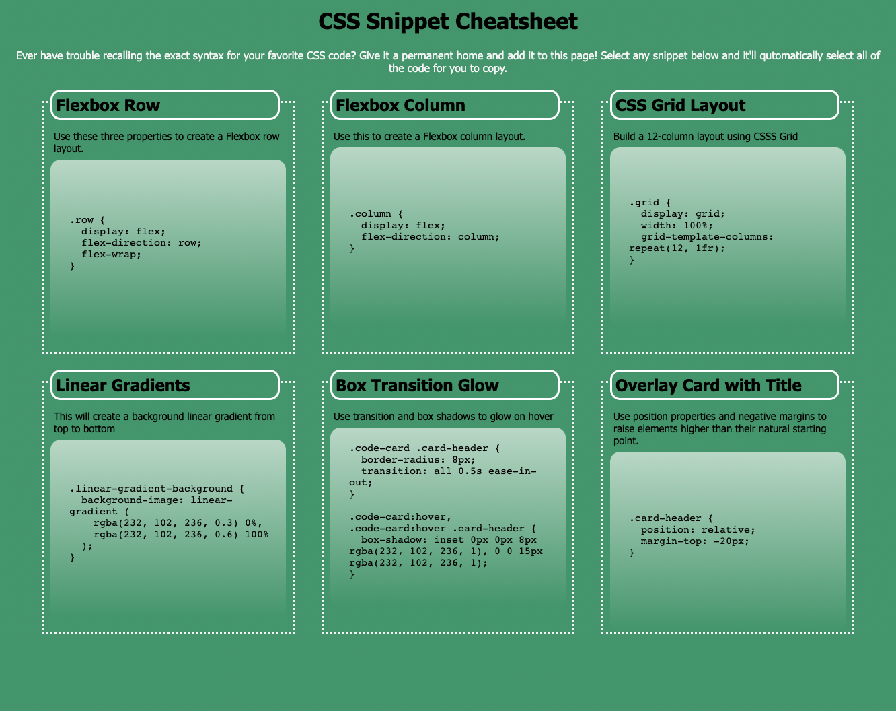
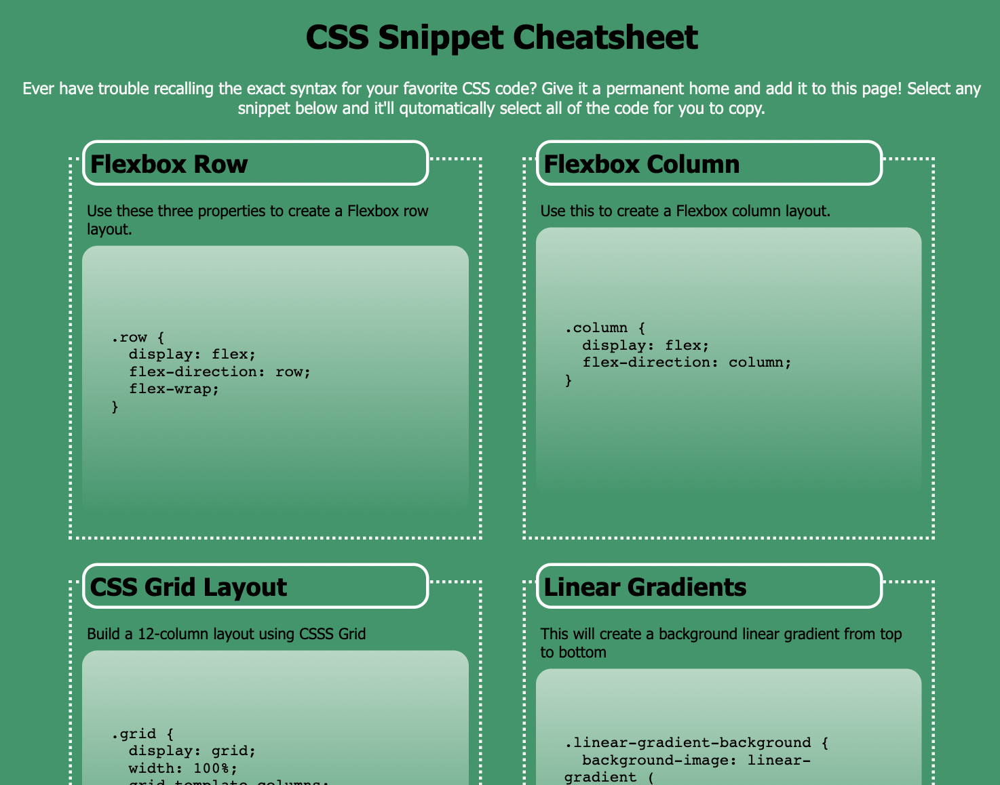
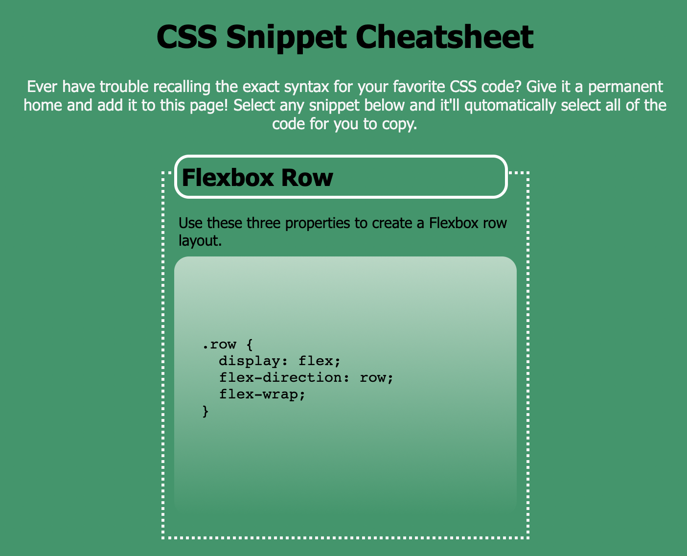

# CSS Cheat Sheet

## Objective
Create a responsive webage using CSS properties. This webpage holds a CSS "cheat sheet" which displays the CSS code for a number of different displayed elements. The page responds two multiple breakpoints to be both desktop and mobile friendly. 

## Technologies Used
HTML & CSS

## Links
* Deployed Site: https://evapopp.github.io/miniproject-2/
* Repo: https://github.com/evapopp/miniproject-2

## Page Preview

